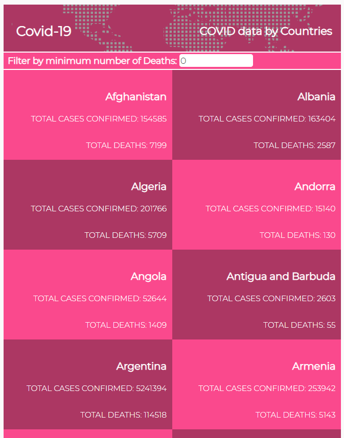

# COVID NEWS APP

> This is a mobile web app the provides daily updates on the global spread of covid-19. The data is sourced from the [Narrativa Data API](https://covid19tracking.narrativa.com/index_en.html). The project is build with React a JavaScript library, and Redux for state management. 

The app displays the global statistics on the spread of covid-19 for each country, number of confirmed cases and deaths. You click on a particular country to get detailed information about that country. 

## Built With

- HTML5
- CSS3
- JavaScript
- Ract
- Redux

## Video Presentation

[Checkout my video presentation](https://www.loom.com/share/8571a7b61f7646ba83ea77e5ea9f9949)

## Live Demo

[Checkout the live version](https://laughing-hopper-2478f4.netlify.app/)

## Getting Started
To get a local copy up and running follow these simple example steps.
- Open your terminal
- Clone the repository: `git clone git@github.com:tiagorahal/covid-tracker.git`
- Cd into 
- Run npm install to install dependencies
- Run npm start to run the app on the browser
- Run npm test to run the tests.

### Prerequisites
- Node v14.9.0

## Author

👨‍💻 **Tiago Rahal Aires**

- GitHub: [@tiagorahal](https://github.com/tiagorahal)
- Twitter: [@RahalAires](https://twitter.com/RahalAires)
- LinkedIn: [Tiago Rahal Aires](https://linkedin.com/tiagorahal)

## 🤝 Contributing

Contributions, issues, and feature requests are welcome!

Feel free to check the [issues page](https://github.com/tiagorahal/covid-tracker/issues).

## Show your support

Give a ⭐️ if you like this project!

## Acknowledgments

- Microverse community
- Original design idea by [Nelson Sakwa on Behance](https://www.behance.net/gallery/31579789/Ballhead-App-%28Free-PSDs%29)

## 📝 License

This project is [MIT](./MIT.md) licensed.
